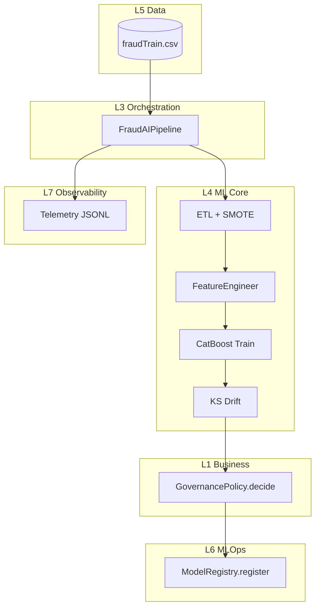
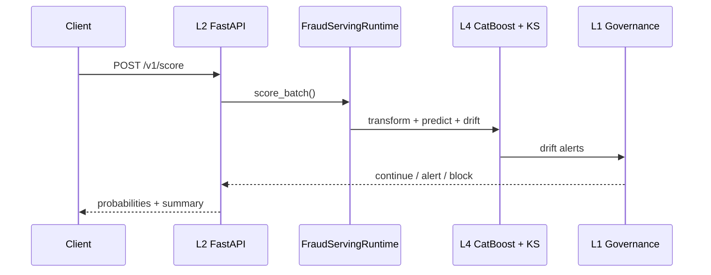
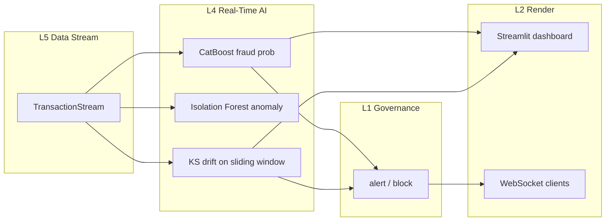

# AI World Architecture (Top-Down)

This document describes how the fraud platform is structured **from business intent down to
infrastructure**, mapping each layer to code you can navigate and execute.

## The Seven Layers

```text
┌─────────────────────────────────────────────────────────────────────────────┐
│ L1  BUSINESS & RISK          Fraud SLAs, adversarial drift, retrain policy   │
├─────────────────────────────────────────────────────────────────────────────┤
│ L2  EXPERIENCE               REST API · WebSocket · Streamlit dashboard    │
├─────────────────────────────────────────────────────────────────────────────┤
│ L3  ORCHESTRATION            `FraudAIPipeline` + stage graph                 │
├─────────────────────────────────────────────────────────────────────────────┤
│ L4  ML CORE                  Batch ML + Real-Time AI (CatBoost · IF · KS)    │
├─────────────────────────────────────────────────────────────────────────────┤
│ L5  DATA PLANE               credit_dt train/test (`src/data`)               │
├─────────────────────────────────────────────────────────────────────────────┤
│ L6  MLOPS                    `ModelRegistry` — version, promote, lineage     │
├─────────────────────────────────────────────────────────────────────────────┤
│ L7  OBSERVABILITY            `Telemetry` — JSONL events + run manifests      │
└─────────────────────────────────────────────────────────────────────────────┘
```

**Design principle:** Upper layers *decide*; lower layers *compute*. Business governance never
trains models directly—it reacts to metrics and drift signals produced below.

## Layer → Code Map

| Layer | Responsibility | Primary modules |
| --- | --- | --- |
| **L1 Business** | When to alert, retrain, or block serving | `src/governance/policy.py` |
| **L2 Experience** | How users/systems invoke AI | `src/api/`, `dashboard/`, `src/serving/` |
| **L3 Orchestration** | Ordered lifecycle, shared context | `src/orchestration/pipeline.py`, `stages.py` |
| **L4 ML Core** | Batch + real-time AI | `src/etl`, `inference`, `monitoring`, **`src/realtime`** |
| **L5 Data** | Ingestion & schema | `src/data/credit_dt.py`, `config.yaml` |
| **L6 MLOps** | Registry & promotion | `src/registry/model_registry.py` |
| **L7 Observability** | Audit trail per run | `src/observability/telemetry.py` |

## Top-Down Execution (Training)



### Stage graph (orchestration)

| Order | Stage | Layer | Output in `PipelineContext` |
| --- | --- | --- | --- |
| 1 | `DATA_INGEST` | L5 | `data_path` |
| 2 | `ETL` | L4 | `etl_result` (incl. pre-SMOTE baseline) |
| 3 | `FEATURE_ENGINEERING` | L4 | `eng_result`, scaler artifacts |
| 4 | `TRAIN` | L4 | CatBoost `.cbm` |
| 5 | `EVALUATE` | L4 | `train_metrics` (ROC-AUC, F1) |
| 6 | `DRIFT_BASELINE` | L4 | KS reference distributions |
| 7 | `DRIFT_CHECK` | L4 | Hold-out drift proxy |
| 8 | `REGISTER` | L6 | `ModelArtifact` |
| 9 | `GOVERNANCE` | L1 | `governance_action` |
| — | Registry promote | L6 | `artifacts/registry/registry.json` |

## Top-Down Execution (Serving)



## Governance Rules (L1)

Configured in `config.yaml` → `governance`:

| Signal | Action |
| --- | --- |
| ROC-AUC &lt; `min_roc_auc` | `retrain_recommended` |
| ≥ `drift_features_block` drifted features (or 5+ high severity) | `block_serve` |
| ≥ `drift_features_alert` drifted features | `alert` |
| Otherwise | `continue` |

This encodes **adversarial drift**: fraudsters shift feature distributions; KS-tests fire;
business policy decides whether the model remains trustworthy.

## MLOps Registry (L6)

Each training run registers a versioned artifact:

```json
{
  "model_id": "fraud_catboost",
  "version": "v_a1b2c3d4",
  "path": "artifacts/models/catboost_fraud.cbm",
  "metrics": { "roc_auc": 0.99, "f1": 0.85 }
}
```

`production` in `registry.json` points to the promoted version used by `FraudServingRuntime`.

## Observability (L7)

Per run:

- `artifacts/telemetry/{run_id}_events.jsonl` — stage-level events with layer tags
- `artifacts/telemetry/{run_id}_manifest.json` — consolidated manifest
- `artifacts/run_summary.json` — quick dashboard JSON

## CLI & API Commands

```bash
# Print the seven-layer stack
python main.py --architecture

# Full training pipeline (L3→L7)
python main.py

# Batch serving (L2)
python main.py --serve data/credit_dt/fraudTest.csv

# HTTP experience layer (L2)
python main.py --api
# GET  http://127.0.0.1:8000/architecture
# GET  http://127.0.0.1:8000/health
# POST http://127.0.0.1:8000/v1/score

# Real-time AI stream (terminal)
python main.py --realtime --max-batches 100

# Live dashboard (Streamlit)
python main.py --dashboard

# WebSocket real-time ticks
python main.py --api
# WS ws://127.0.0.1:8000/v1/realtime/ws
# GET http://127.0.0.1:8000/v1/realtime/status
```

## Real-Time AI Subsystem (L4 extension)

The **RealtimeFraudAIEngine** (`src/realtime/ai_engine.py`) extends batch ML Core for streaming fraud operations:



| AI model | Type | Real-time role |
| --- | --- | --- |
| **CatBoost** | Supervised classifier | `fraud_probability` per transaction batch |
| **Isolation Forest** | Unsupervised anomaly | `mean_anomaly_score` — catches novel fraud patterns |
| **KS monitor** | Statistical | Sliding-window covariate drift vs training baseline |

Configuration: `config.yaml` → `realtime` (`window_size`, `drift_check_interval`, `transactions_per_second`).

Training registers the anomaly model via `AnomalyModelStage` → `artifacts/models/anomaly_iforest.joblib`.

## How ML Modules Fit the AI World

The original four modules are **L4 ML Core** building blocks—unchanged in responsibility, now
**composed** by orchestration instead of a flat script:

| ML Module | AI role |
| --- | --- |
| ETL + SMOTE | Prepare adversarial-ready training manifold |
| Engineering | Serving-compatible transforms |
| CatBoost | Decision engine (why vs Random Forest: boosting + imbalance) |
| KS Monitor | Covariate drift sensor feeding L1 |

## Extension Roadmap

| Layer | Next step |
| --- | --- |
| L5 | Kafka / feature store connector |
| L6 | MLflow or cloud model registry |
| L7 | Prometheus metrics, Grafana dashboards |
| L1 | Human-in-the-loop review queue for `alert` state |
| L2 | AuthN/Z, rate limits on `/v1/score` |
