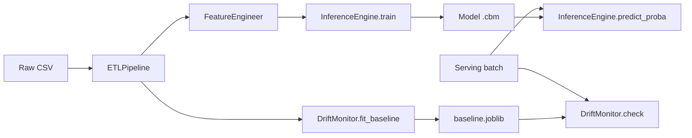

# ML Core Architecture

> **Platform context:** This file documents **L4 ML Core** modules. For the full seven-layer AI World stack (Business → Observability), see **[AI_WORLD_ARCHITECTURE.md](AI_WORLD_ARCHITECTURE.md)**.

## Abstract

Financial fraud detectors operate in an **adversarial** environment: attackers adapt, so models trained on historical data degrade at serving time (**concept** and **covariate drift**). Legitimate transactions dominate the stream (~**0.17%** fraud in the ULB Kaggle set — roughly **1000:1**), which collapses accuracy as a metric and hides rare fraud patterns.

This project implements a **four-module pipeline**:

1. **ETL** — reproducible cleaning and **SMOTE** class balancing on the training split only (test set stays untouched).
2. **Engineering** — feature scaling for the booster; **PCA** reduced to 2 components for exploratory plots (not used as model inputs, since Kaggle features are already PCA-derived).
3. **Inference** — **CatBoost** classifier with balanced class weights.
4. **Monitoring** — per-feature **Kolmogorov–Smirnov (KS)** tests between training baseline histograms and incoming batches.

## Execution Flow

### ETL Module (`src/etl/pipeline.py`)

- **Input:** `creditcard.csv` (or synthetic equivalent).
- **Cleaning:** drop duplicates; median imputation for numeric NaNs.
- **Split:** stratified hold-out (`test_size` from config).
- **SMOTE:** applied **only** on `X_train, y_train` to synthesize minority fraud examples; prevents leakage into evaluation.
- **Drift baseline:** KS reference distributions are stored from **pre-SMOTE** `X_train_raw` so serving data is compared to the natural training manifold, not the synthetic oversampled one.

### Engineering Module (`src/engineering/features.py`)

- **StandardScaler** fit on training, applied to train and test.
- **PCA (n=2):** visualization artifact (`artifacts/plots/pca_train.png`); documents separability after SMOTE on the training manifold.
- Persisted `scaler.joblib` (and optional `pca.joblib`) for serving.

### Inference Engine (`src/inference/engine.py`)

- **CatBoostClassifier** with `eval_metric=AUC`, `auto_class_weights=Balanced`.
- Saves native CatBoost model (`artifacts/models/catboost_fraud.cbm`).
- Reports ROC-AUC, F1, classification report on the **imbalanced** test set (realistic serving conditions).

### Monitoring Module (`src/monitoring/drift.py`)

For each feature \(f\):

1. Store training reference values \(\{x_i^{train}\}\).
2. At serving, collect \(\{x_j^{serve}\}\).
3. Run **KS two-sample test**: \(H_0\) — both samples drawn from the same distribution.
4. Flag drift if \(p < \alpha\) (default 0.05).

KS is distribution-free and well-suited to continuous fraud features (Amount, V*, Time). It does **not** detect label/concept drift alone; retraining triggers should combine KS alerts with sliding-window **precision/recall** on labeled chargebacks.

## Algorithm Notes: CatBoost + SMOTE

**SMOTE** interpolates between nearest-neighbor fraud points in feature space, increasing minority exposure during training without duplicating identical rows.

**CatBoost** builds additive trees via gradient descent on a differentiable loss, with ordered boosting to reduce target leakage from categoricals. For fraud:

- Boosting emphasizes **hard negatives** misclassified by prior trees.
- Handles severe imbalance via class weights without manual resampling ratios (used here **with** SMOTE for coursework clarity).

**Caution:** SMOTE on high-dimensional PCA features can create unrealistic synthetic fraud points; production systems often prefer threshold tuning, cost-sensitive learning, or anomaly detection instead of aggressive oversampling.

## Configuration & Artifacts

| Artifact | Description |
|----------|-------------|
| `artifacts/models/catboost_fraud.cbm` | Serialized booster |
| `artifacts/baselines/feature_distributions.joblib` | Per-feature training arrays for KS |
| `artifacts/drift_report.csv` | KS statistics on test split (proxy for serving) |
| `artifacts/run_summary.json` | ROC-AUC, F1, drifted feature list |
| `artifacts/feature_importance.csv` | CatBoost importance ranking |

## Extension Points

- **PaySim:** add categorical `type` column to CatBoost `cat_features` index list.
- **Retraining:** schedule when `DriftMonitor.drifted_features()` is non-empty or AUC drops below SLA.
- **Alternative drift:** Population Stability Index (PSI) for binned Amount/Time.

## References

- Dal Pozzolo et al., *Calibrating Probability with Undersampling for Unbalanced Classification* (Kaggle ULB dataset).
- Haixiang Guo et al., SMOTE for imbalanced learning.
- Prokhorenkova et al., CatBoost: unbiased boosting with categorical features.
